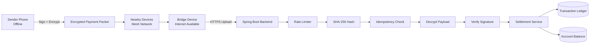
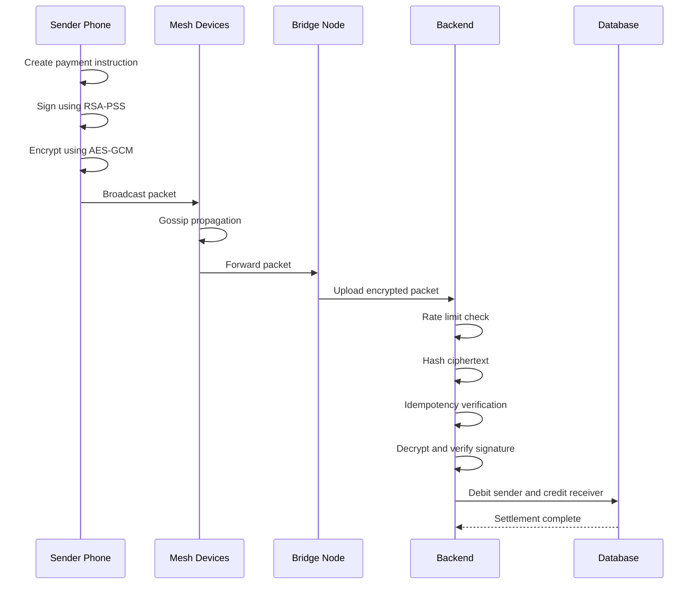

# OffPay - Offline UPI Mesh Payment System


OffPay is an offline payment network that enables UPI-style transactions without direct internet connectivity.

A sender device creates a digitally signed and encrypted payment packet. The packet travels through a Bluetooth-style mesh network between nearby devices. When a bridge device gets internet access, it uploads the packet to the backend for verification and settlement.

The backend verifies authenticity, prevents duplicate payments, detects replay attacks, and maintains a transaction ledger.

---

# Live Demo

Demo URL:

https://candy-teens-meters-green.trycloudflare.com/

Note:
The demo runs through Cloudflare Tunnel from local deployment. The link stays active only while the server is running.

---

# Key Features

## Offline Mesh Payment Flow

- Sender creates payment while offline.
- Payment packet is encrypted and signed.
- Packets propagate through nearby devices using mesh routing.
- Bridge device uploads transactions when internet becomes available.

## Security

- RSA-PSS digital signatures for sender verification.
- AES-256-GCM encryption for transaction confidentiality.
- RSA-OAEP encryption for secure key exchange.
- SHA-256 packet hashing.
- Replay attack protection.
- Duplicate transaction prevention.

## Backend Reliability

- Atomic idempotency handling.
- Rate limiting for bridge nodes.
- Transaction ledger.
- Database locking during settlement.
- Automated CI testing.
- Docker deployment support.

---

# Architecture



---

# System Flow



---

# Tech Stack

## Backend

- Java 17
- Spring Boot 3
- Spring Data JPA
- Hibernate
- Maven

## Security

- RSA-OAEP
- RSA-PSS
- AES-256-GCM
- SHA-256 hashing

## Database

- H2 Database
- PostgreSQL production profile

## DevOps

- Docker
- Docker Compose
- GitHub Actions CI

## Documentation

- OpenAPI / Swagger UI

---

# How It Works

## 1. Create Payment

The sender creates a payment instruction containing:

- Sender VPA
- Receiver VPA
- Amount
- Timestamp
- Unique nonce

The payload is signed using the sender device key.

The signed payload is encrypted before entering the mesh.

---

## 2. Mesh Propagation

Nearby devices store and forward the encrypted packet.

Intermediate devices:

- Cannot read transaction data.
- Cannot modify payment details.
- Cannot create valid payments.

The packet moves until it reaches a bridge device.

---

## 3. Bridge Upload

A bridge device with internet connectivity sends the packet to:

```
POST /api/bridge/ingest
```

The backend performs:

1. Rate limit validation.
2. Packet hashing.
3. Duplicate detection.
4. Decryption.
5. Signature verification.
6. Timestamp validation.
7. Settlement.

---

# Duplicate Payment Protection

OffPay prevents duplicate settlements using atomic idempotency.

Flow:

```
Receive Packet
      |
      v
Generate SHA-256 Hash
      |
      v
Check Existing Hash
      |
      +---- Exists --> Reject Duplicate
      |
      +---- New -----> Continue Settlement
```

Multiple bridge devices uploading the same packet result in only one successful settlement.

---

# Security Design

## Encryption

Hybrid encryption is used:

```
Payment Data
     |
     v
AES-256-GCM Encryption
     |
     v
AES Key Protected using RSA-OAEP
```

AES provides fast encryption.

RSA protects the encryption key.

---

## Digital Signature

The sender signs the transaction before encryption.

Backend verifies:

```
Payment Data
      |
      v
RSA-PSS Signature
      |
      v
Trusted Device Public Key
```

This prevents forged payments.

---

# Project Structure

```
OffPay

├── src/main/java
│
├── controller
│   ├── ApiController
│   └── DashboardController
│
├── service
│   ├── SettlementService
│   ├── MeshSimulatorService
│   ├── BridgeIngestionService
│   ├── IdempotencyService
│   └── RateLimiterService
│
├── crypto
│   ├── HybridCryptoService
│   ├── SignatureService
│   └── ServerKeyHolder
│
├── model
│   ├── Account
│   ├── Transaction
│   ├── MeshPacket
│   └── PaymentInstruction
│
├── Dockerfile
├── docker-compose.yml
├── pom.xml
└── README.md
```

---

# API Endpoints

| Method | Endpoint | Description |
|---|---|---|
| GET | `/` | Dashboard |
| GET | `/api/accounts` | View balances |
| GET | `/api/transactions` | View ledger |
| GET | `/api/mesh/state` | Mesh status |
| POST | `/api/demo/send` | Create demo payment |
| POST | `/api/mesh/gossip` | Run mesh propagation |
| POST | `/api/mesh/flush` | Upload from bridge |
| POST | `/api/bridge/ingest` | Production ingestion endpoint |
| POST | `/api/mesh/reset` | Reset demo state |
| GET | `/swagger-ui.html` | API documentation |

---

# Run Locally

## Clone Repository

```bash
git clone https://github.com/i-Anurag1/OffPay.git

cd OffPay
```

---

## Run Application

Windows:

```bash
.\mvnw.cmd spring-boot:run
```

Linux / Mac:

```bash
./mvnw spring-boot:run
```

Open:

```
http://localhost:8080
```

---

# Run Using Docker

Build image:

```bash
docker build -t offpay .
```

Run container:

```bash
docker run -p 8080:8080 offpay
```

Using Docker Compose:

```bash
docker compose up --build
```

---

# Testing

Run tests:

```bash
./mvnw test
```

Important tests:

- Encryption and decryption validation.
- Tampered packet rejection.
- Concurrent duplicate delivery handling.

Example:

```
3 bridge nodes
        |
        |
Same payment packet
        |
        v
Backend

1 SETTLED
2 DUPLICATE_DROPPED
```

---

# Current Limitations

This project demonstrates offline payment routing and backend settlement logic.

For production deployment:

- Real Android BLE communication is required.
- Real UPI/NPCI integration is required.
- Hardware-backed device keys are required.
- Redis should replace in-memory idempotency storage.
- Production database replication is required.

---

# Future Improvements

- Android Kotlin BLE application.
- Real device-to-device mesh communication.
- Kafka event sourcing for transaction events.
- Redis distributed idempotency.
- Kubernetes deployment.
- Bank API integration.

---

# Author

Anurag Thakur

GitHub:
https://github.com/i-Anurag1
