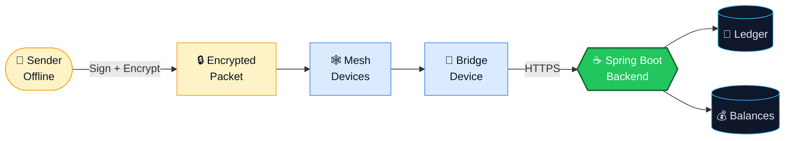
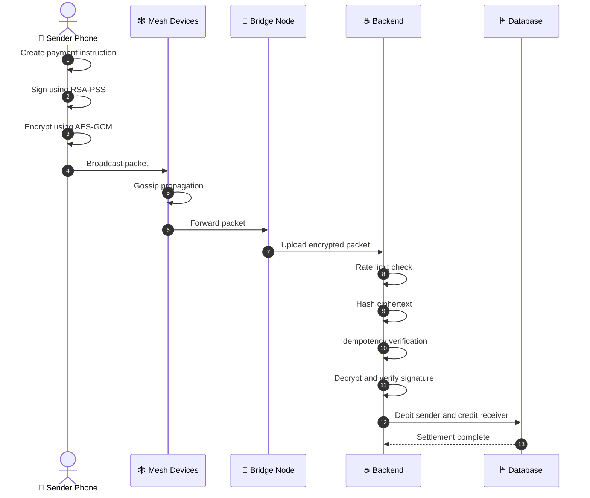
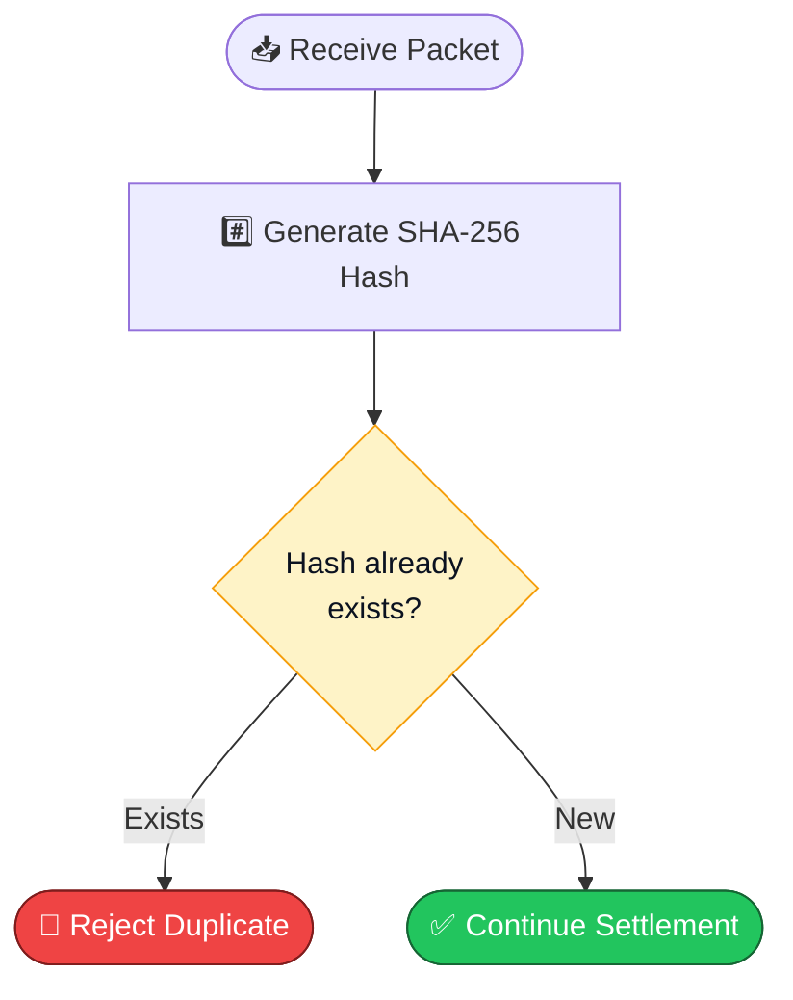
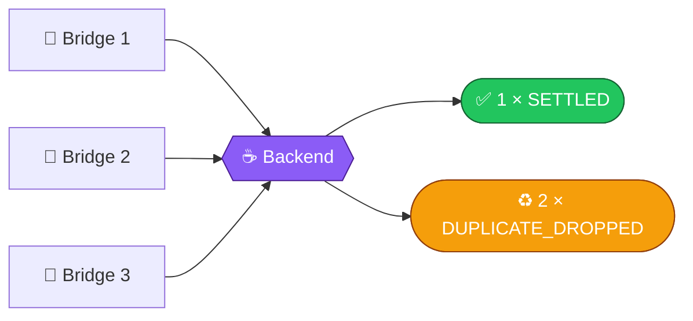
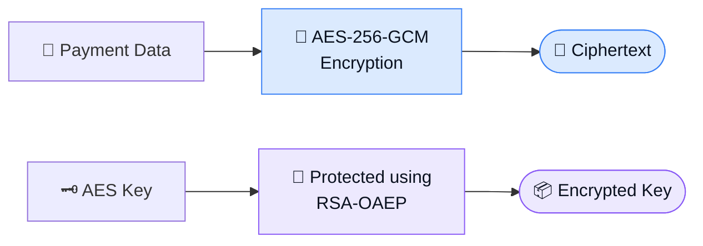
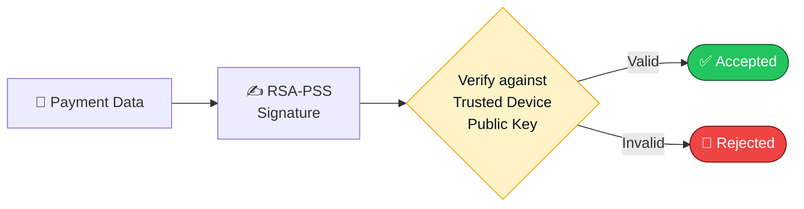
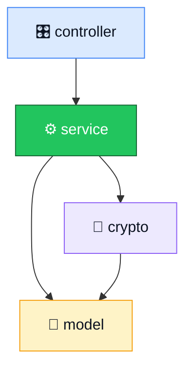
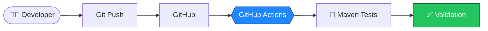
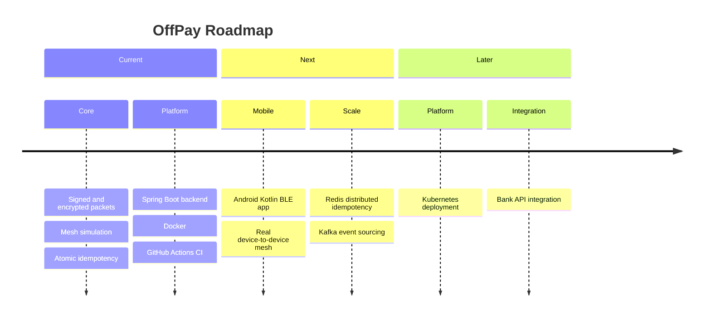

<div align="center">


<br/>

**An offline payment network that enables UPI-style transactions without direct internet connectivity.**

<br/>

[](https://openjdk.org/)
[](https://spring.io/projects/spring-boot)
[](https://maven.apache.org/)
[](https://www.docker.com/)
[](https://www.postgresql.org/)
[](https://swagger.io/)

[](https://github.com/i-Anurag1/OffPay/actions/workflows/ci.yml)

<br/>

[](https://off-pay-five.vercel.app/)
[](https://github.com/i-Anurag1/OffPay)

<br/>

<a href="#-overview">Overview</a> &nbsp;·&nbsp;
<a href="#-features">Features</a> &nbsp;·&nbsp;
<a href="#-architecture">Architecture</a> &nbsp;·&nbsp;
<a href="#-how-it-works">How It Works</a> &nbsp;·&nbsp;
<a href="#-security-design">Security</a> &nbsp;·&nbsp;
<a href="#-api-reference">API</a> &nbsp;·&nbsp;
<a href="#-quick-start">Quick Start</a> &nbsp;·&nbsp;
<a href="#-roadmap">Roadmap</a>

</div>

<br/>

```text
 ██████╗ ███████╗███████╗██████╗  █████╗ ██╗   ██╗
██╔═══██╗██╔════╝██╔════╝██╔══██╗██╔══██╗╚██╗ ██╔╝
██║   ██║█████╗  █████╗  ██████╔╝███████║ ╚████╔╝ 
██║   ██║██╔══╝  ██╔══╝  ██╔═══╝ ██╔══██║  ╚██╔╝  
╚██████╔╝██║     ██║     ██║     ██║  ██║   ██║   
 ╚═════╝ ╚═╝     ╚═╝     ╚═╝     ╚═╝  ╚═╝   ╚═╝   
```

> **OffPay** lets a phone with no connectivity create a signed, encrypted payment. Nearby devices carry it hop by hop until one of them reaches the internet. The backend then verifies, deduplicates and settles it.

<br/>

## ✦ At a Glance

<div align="center">

| 🔐 **3** | 🔑 **256-bit** | 🧾 **7** | 🌐 **10** | 🎯 **1** |
|:---:|:---:|:---:|:---:|:---:|
| Cryptographic layers | AES-GCM encryption | Ingestion checks | API endpoints | Settlement per packet |

</div>

<br/>

## ✦ Overview

The backend verifies authenticity, prevents duplicate payments, detects replay attacks and maintains a transaction ledger.

> **Intermediate devices carry packets they cannot read, cannot modify and cannot forge.**



<br/>

## ✦ Features

<div align="center">

| 🕸️ Offline Mesh Flow | 🛡️ Security | ⚙️ Backend Reliability |
|:---|:---|:---|
| Sender creates payment while offline | RSA-PSS digital signatures | Atomic idempotency handling |
| Packet is encrypted and signed | AES-256-GCM encryption | Rate limiting for bridge nodes |
| Packets propagate through mesh routing | RSA-OAEP key exchange | Transaction ledger |
| Bridge uploads when internet returns | SHA-256 packet hashing | Database locking during settlement |
| | Replay attack protection | Automated CI testing |
| | Duplicate transaction prevention | Docker deployment support |

</div>

<br/>

## ✦ Architecture

```mermaid
flowchart LR
    A(["📱 Sender Phone<br/>Offline"]) -->|"Sign + Encrypt"| B["🔒 Encrypted Payment Packet"]
    B --> C["🕸️ Nearby Devices<br/>Mesh Network"]
    C --> D["📡 Bridge Device<br/>Internet Available"]
    D -->|"HTTPS Upload"| E{{"☕ Spring Boot Backend"}}

    E --> F["🚦 Rate Limiter"]
    F --> G["#️⃣ SHA-256 Hash"]
    G --> H["♻️ Idempotency Check"]
    H --> I["🔓 Decrypt Payload"]
    I --> J["✍️ Verify Signature"]
    J --> K["🏦 Settlement Service"]

    K --> L[("📒 Transaction Ledger")]
    K --> M[("💰 Account Balance")]

    classDef edge fill:#FEF3C7,stroke:#F59E0B,color:#0B1220
    classDef net fill:#DBEAFE,stroke:#3B82F6,color:#0B1220
    classDef core fill:#22C55E,stroke:#166534,color:#fff,stroke-width:2px
    classDef guard fill:#EDE9FE,stroke:#8B5CF6,color:#0B1220
    classDef store fill:#0F172A,stroke:#38BDF8,color:#E2E8F0
    class A,B edge
    class C,D net
    class E,K core
    class F,G,H,I,J guard
    class L,M store
```



<br/>

## ✦ System Flow



<br/>

## ✦ How It Works

### ① Create Payment

The sender creates a payment instruction containing:

<div align="center">

| 👤 Sender VPA | 🎯 Receiver VPA | 💵 Amount | 🕒 Timestamp | 🎲 Unique Nonce |
|:---:|:---:|:---:|:---:|:---:|

</div>

The payload is **signed** with the sender device key, then **encrypted** before it enters the mesh.

### ② Mesh Propagation

Nearby devices store and forward the encrypted packet. Intermediate devices:

<div align="center">

| ❌ Cannot read | ❌ Cannot modify | ❌ Cannot forge |
|:---:|:---:|:---:|
| Transaction data | Payment details | Valid payments |

</div>

The packet keeps moving until it reaches a bridge device.

### ③ Bridge Upload

A bridge device with internet connectivity sends the packet to:

```http
POST /api/bridge/ingest
```


<br/>

## ✦ Duplicate Payment Protection

OffPay prevents duplicate settlements using **atomic idempotency**.



Multiple bridge devices uploading the same packet result in **exactly one** successful settlement.



<br/>

## ✦ Security Design

### Hybrid Encryption

AES provides fast encryption. RSA protects the encryption key.



### Digital Signature

The sender signs the transaction **before** encryption. The backend verifies it against the trusted device public key, which prevents forged payments.



### Threat Coverage

<div align="center">

| Threat | Defense |
|:---|:---|
| Reading data in transit | AES-256-GCM encryption |
| Tampering with a packet | GCM authentication and RSA-PSS signature |
| Forged payments | RSA-PSS signature checked against the device public key |
| Duplicate delivery | SHA-256 hash with atomic idempotency |
| Replay attacks | Unique nonce and timestamp validation |
| Abusive bridge nodes | Rate limiting |
| Race conditions at settlement | Database locking during settlement |

</div>

<br/>

## ✦ Tech Stack

<div align="center">

| Layer | Technologies |
|:---|:---|
| **Backend** |      |
| **Security** | RSA-OAEP · RSA-PSS · AES-256-GCM · SHA-256 hashing |
| **Database** |   H2 for demo, PostgreSQL production profile |
| **DevOps** |  Docker Compose  |
| **Documentation** |  Swagger UI |

</div>

<br/>

## ✦ Project Structure

```text
OffPay/
│
├── src/main/java/
│   │
│   ├── controller/
│   │   ├── ApiController
│   │   └── DashboardController
│   │
│   ├── service/
│   │   ├── SettlementService
│   │   ├── MeshSimulatorService
│   │   ├── BridgeIngestionService
│   │   ├── IdempotencyService
│   │   └── RateLimiterService
│   │
│   ├── crypto/
│   │   ├── HybridCryptoService
│   │   ├── SignatureService
│   │   └── ServerKeyHolder
│   │
│   └── model/
│       ├── Account
│       ├── Transaction
│       ├── MeshPacket
│       └── PaymentInstruction
│
├── Dockerfile
├── docker-compose.yml
├── pom.xml
└── README.md
```



<br/>

## ✦ API Reference

<div align="center">

| Method | Endpoint | Description |
|:---:|:---|:---|
|  | `/` | Dashboard |
|  | `/api/accounts` | View balances |
|  | `/api/transactions` | View ledger |
|  | `/api/mesh/state` | Mesh status |
|  | `/api/demo/send` | Create demo payment |
|  | `/api/mesh/gossip` | Run mesh propagation |
|  | `/api/mesh/flush` | Upload from bridge |
|  | `/api/bridge/ingest` | Production ingestion endpoint |
|  | `/api/mesh/reset` | Reset demo state |
|  | `/swagger-ui.html` | API documentation |

</div>

<br/>

## ✦ Quick Start

<details open>
<summary><b>1 · Clone the repository</b></summary>

<br/>

```bash
git clone https://github.com/i-Anurag1/OffPay.git
cd OffPay
```

</details>

<details open>
<summary><b>2 · Run the application</b></summary>

<br/>

Windows:

```bash
.\mvnw.cmd spring-boot:run
```

Linux / macOS:

```bash
./mvnw spring-boot:run
```

Then open `http://localhost:8080`.

</details>

<details>
<summary><b>3 · Run with Docker</b></summary>

<br/>

Build the image:

```bash
docker build -t offpay .
```

Run the container:

```bash
docker run -p 8080:8080 offpay
```

Or use Docker Compose:

```bash
docker compose up --build
```

</details>

<details>
<summary><b>4 · Run the tests</b></summary>

<br/>

```bash
./mvnw test
```

</details>

<br/>

## ✦ Testing

<div align="center">

| 🔐 Cryptography | 🧨 Tamper Resistance | 🏁 Concurrency |
|:---:|:---:|:---:|
| Encryption and decryption validation | Tampered packet rejection | Concurrent duplicate delivery handling |

</div>



<br/>

## ✦ Current Limitations

This project demonstrates **offline payment routing and backend settlement logic**. Production deployment would require:

<div align="center">

| Area | Requirement |
|:---|:---|
| 📶 Connectivity | Real Android BLE communication |
| 🏛️ Payments | Real UPI / NPCI integration |
| 🔑 Device trust | Hardware-backed device keys |
| ⚡ Idempotency | Redis replacing in-memory idempotency storage |
| 🗄️ Data | Production database replication |

</div>

<br/>

## ✦ Roadmap



<br/>

## ✦ Author

<div align="center">

**Anurag Thakur**

[](https://github.com/i-Anurag1)

</div>

<br/>

<div align="center">

```text
SIGN  →  ENCRYPT  →  GOSSIP  →  BRIDGE  →  VERIFY  →  SETTLE
```

### Offline-first payments, verified on arrival

**Built with Java 17 · Spring Boot 3 · JPA · Docker · GitHub Actions**

<br/>

[Live Demo](https://off-pay-five.vercel.app/) &nbsp;·&nbsp; [Source Code](https://github.com/i-Anurag1/OffPay)


</div>
